# Project: An Algorithm for a Dog Identification Web App 

---


## Table of Contents

We break the notebook into separate steps.  Feel free to use the links below to navigate the notebook.

* [Step 0](#step0): Import Datasets
* [Step 1](#step1): Detect Humans
* [Step 2](#step2): Detect Dogs
* [Step 3](#step3): Create a CNN to Classify Dog Breeds (from Scratch)
* [Step 4](#step4): Create a CNN to Classify Dog Breeds (using Transfer Learning)
* [Step 5](#step5): Write your Algorithm
* [Step 6](#step6): Test Your Algorithm

---
<a id='step0'></a>
## Step 0: Import Datasets

Make sure that you've downloaded the required human and dog datasets:

**Note: if you are using the Udacity workspace, you *DO NOT* need to re-download these - they can be found in the `/data` folder as noted in the cell below.**

* Download the [dog dataset](https://s3-us-west-1.amazonaws.com/udacity-aind/dog-project/dogImages.zip).  Unzip the folder and place it in this project's home directory, at the location `/dog_images`. 

* Download the [human dataset](https://s3-us-west-1.amazonaws.com/udacity-aind/dog-project/lfw.zip).  Unzip the folder and place it in the home directory, at location `/lfw`.  

In the code cell below, we save the file paths for both the human (LFW) dataset and dog dataset in the numpy arrays `human_files` and `dog_files`.

<a id='step1'></a>
## Step 1: Detect Humans

In this section, we use OpenCV's implementation of [Haar feature-based cascade classifiers](http://docs.opencv.org/trunk/d7/d8b/tutorial_py_face_detection.html) to detect human faces in images.  OpenCV provides many pre-trained face detectors, stored as XML files on [github](https://github.com/opencv/opencv/tree/master/data/haarcascades).  We have downloaded one of these detectors and stored it in the `haarcascades` directory.  In the next code cell, we demonstrate how to use this detector to find human faces in a sample image.

---
<a id='step2'></a>
## Step 2: Detect Dogs

In this section, we use a [pre-trained model](http://pytorch.org/docs/master/torchvision/models.html) to detect dogs in images.  Given an image, this pre-trained VGG-16 model returns a prediction (derived from the 1000 possible categories in ImageNet) for the object that is contained in the image.


<a id='step3'></a>
## Step 3: Create a CNN to Classify Dog Breeds (from Scratch)

Now that we have functions for detecting humans and dogs in images, we need a way to predict breed from images. 

In order to fairly compare the transfer learning with the CNN model from scratch, I decided to use the VGG16 structure, shown above, and train the network with a limitted number of epochs (i.e. 20 epochs), so that the final results would satisfy the 10 percent minimum accuracy on the test results. I used the squential approach to implement the model. 

The VGG16 model accepts 224 squared images in RGB. The Kernel size was chosen to be 3 by 3 with a padding of 1 to maintain the spatial resolution. The conv2d command was used to create the convolutional layers (e.g. the first layer is a convolutional layer that takes the (224, 224, 3) RGB image, and it is defined as: Conv2d(in_channels=3, out_channels=64, kernel_size=3, padding=1)). Each convolutional layer is followed by a batch normalization procedure to normalize the outputs in a unit variance, zero mean scale. Then, a ReLU activation function was used on the normalized data from each convolutional layer. 

Each layer of the CNN network contains an assembly of two or three convolutional layers, and it is followed by a max-pooling step of with a 2 by 2 kernel size and stride of 1 (i.e. MaxPool2d(kernel_size=2, stride=2, padding=0, dilation=1, ceil_mode=False)).

Finally, the sizes of the the convolutional and the fully connected layers can be determined by:

Convolutional Layers:

([64, 3, 224, 224]) 

([64, 64, 224, 224])

([64, 128, 112, 112])

([128, 128, 112, 112])

([128, 256, 56, 56])

([256, 256, 56, 56])

([256, 256, 56, 56])

([256, 512, 28, 28])

([512, 512, 28, 28])

([512, 512, 28, 28])

([512, 512, 14, 14])

([512, 512, 14, 14])

([512, 512, 14, 14])

Fully Connected Layers:

([512 * 7 * 7, 4096])

([4096, 4096])

([4096, 133])

---
<a id='step4'></a>
## Step 4: Create a CNN to Classify Dog Breeds (using Transfer Learning)

I implemented the VGG16 available from torchvision, which is a well-known pretrained CNN. The pretrained CNN is composed of feature dectector convolutional layers which are capable of detecting edges and fine details (as they get deeper in the consecutive layers). This CNN is pretrained for a much more generlized computer vision problems than our current dog breed detection problem, therefore we only need to modify and train the final fully connected layer(s) to specify the number of breed categories and transfer the learning capability to our problem. 

The output of the classifier part of the model is modified to the follwing:

    Linear(in_features=4096, out_features=133, bias=True)

to account for the 133 class (breed) names using the following commands:

    n_inputs = model_transfer.classifier[6].in_features
    model_transfer.classifier[6] = nn.Linear(n_inputs, 133).

The pretrained CNN does not require gradient calculations, accordingly I switched the flag to False:

    for param in model_transfer.features.parameters():
        param.required_grad = False

However, the flag would remain True for the newyly added fully connected layer for further training. Finally, the choice of the output was selected to be CrossEntropyLoss(), which combines LogSoftmax and NLLLoss, according to PyTorch documentation. In addition the optimizer was chosen to be SGD algorithm with the learning rate of 0.001. 


---
<a id='step5'></a>
## Step 5: Write your Algorithm

The algorithm accepts a file path to an image and first determines whether the image contains a human, dog, or neither.  Then,
- if a __dog__ is detected in the image, return the predicted breed.
- if a __human__ is detected in the image, return the resembling dog breed.
- if __neither__ is detected in the image, provide output that indicates an error.


```python

```

    Hello, human!
    


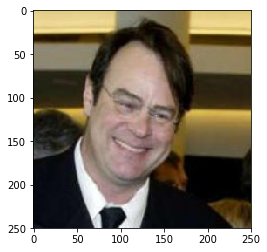


    You look like a  ... 
    
    Dogue de bordeaux, with an associated probability of %1.87:
    
    


    Hello, human!
    


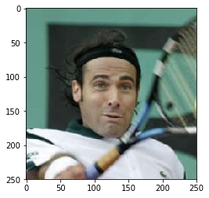


    You look like a  ... 
    
    Bearded collie, with an associated probability of %2.45:
    
    


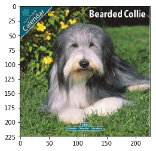


    Hello, human!
    


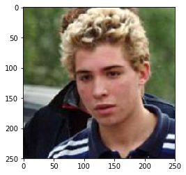


    You look like a  ... 
    
    Wirehaired pointing griffon, with an associated probability of %2.06:
    
    


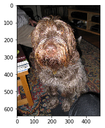


    Hello, human!
    


    You look like a  ... 
    
    Wirehaired pointing griffon, with an associated probability of %2.59:
    
    


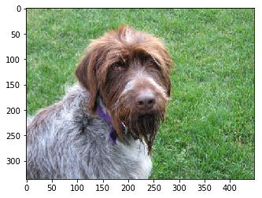


    Hello, human!
    


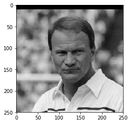


    You look like a  ... 
    
    Wirehaired pointing griffon, with an associated probability of %1.78:
    
    


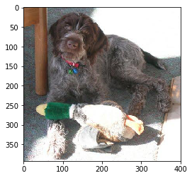


    Hello, human!
    


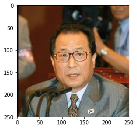


    You look like a  ... 
    
    Field spaniel, with an associated probability of %1.74:
    
    


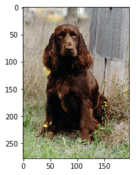


    A dog is detected ...
    


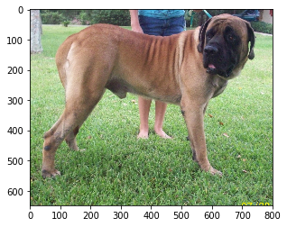


    The predicted breeds is Bullmastiff, with an associated probability of %50.58:
    
    


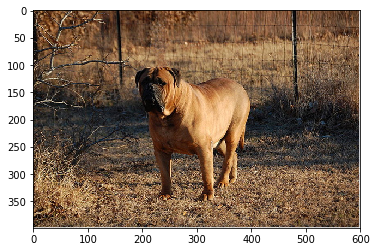


    A dog is detected ...
    


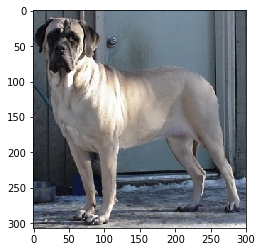


    The predicted breeds is Mastiff, with an associated probability of %34.17:
    
    


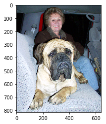


    A dog is detected ...
    


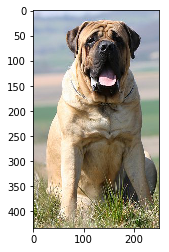


    The predicted breeds is Bullmastiff, with an associated probability of %39.82:
    
    


    A dog is detected ...
    


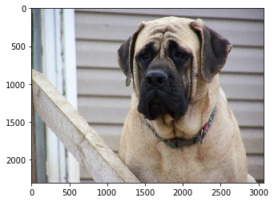


    The predicted breeds is Bullmastiff, with an associated probability of %52.15:
    
    


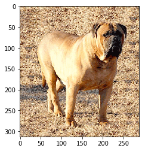


    A dog is detected ...
    


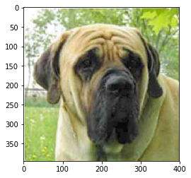


    The predicted breeds is Mastiff, with an associated probability of %46.21:
    
    


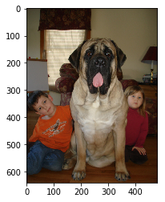


    A dog is detected ...
    


    The predicted breeds is Mastiff, with an associated probability of %74.18:
    
    


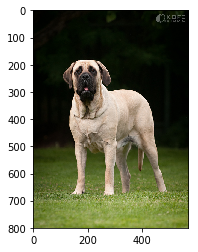


```python

```
